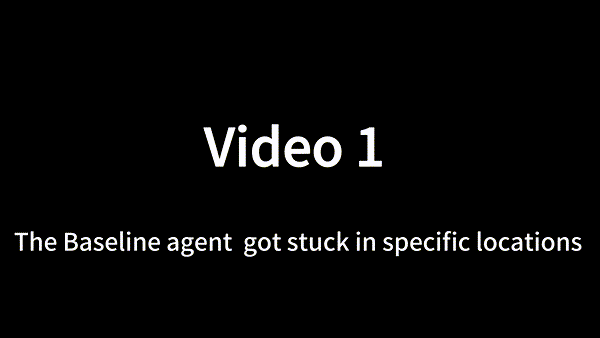
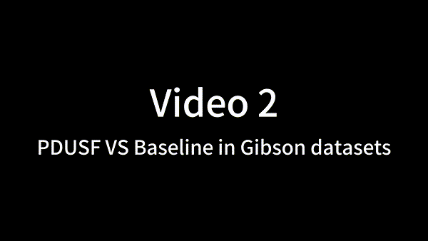
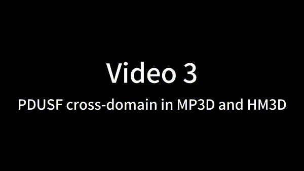

# PDUSF
Implementation of our paper A New Representation of Universal Successor Features for Enhancing the Generalization of Target-Driven Visual Navigation
## 0. Overview
## 1. :rocket:Install 
## 2. Prepare dataset
## 3. Run ImageNav Training 
## 4. Run Evaluation!
## 5. The top-down view of the entire trajectory in the Habitat simulator. 

### 5.1 The Baseline agent got stuck in specific locations.

    

### 5.2 PDUSF PK Baseline in Gibson datasets.

    

### 5.3 PDUSF cross-domain in MP3D and MP3D.
 

    
 

